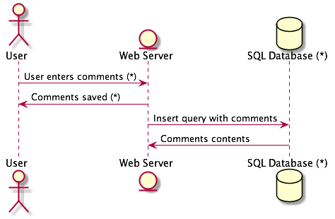

# pytm

A Pythonic framework for threat modeling

For the security practitioner, add threats to the Threat object:

```python
Threats = {
    "DF1": {
        "description": "Dataflow not authenticated",
        "target": Dataflow,
        "condition": "target.authenticatedWith is False"
    },
    "SR1": {
        "description": "Server not hardened",
        "target": Server,
        "condition": "target.isHardened is False"
    }
}
```

**CAVEAT**

The threat.py file contains strings that run through eval\(\) -&gt; make sure the file has correct permissions or risk having an attacker change the strings and cause you to run code on their behalf. The logic lives in the "condition", where members of "target" can be logically evaluated. Returning a true means the rule generates a finding, otherwise, it is not a finding.**

**Usage**

In order to start a threat model, the minimum amount of code is:

```python

# !/usr/bin/env python3

from pytm.pytm import TM, Server, Datastore, Dataflow, Boundary, Actor

tm = TM("my test tm")
tm.description = "another test tm"

tm.process()

```
This provides the most popular elements, as well as the command line argument processing.

Define your system in code as a collection of objects and annotate them with properties, then call out TM.process\(\) to identify threats and TM.report\(\) to write out the report. Helper operations can be chosen on the command line:

```text
usage: tm.py [-h] [--debug] [--dfd] [--report REPORT] [--exclude EXCLUDE]
             [--seq] [--list]

optional arguments:
  -h, --help           show this help message and exit
  --debug              print debug messages
  --dfd                output DFD (default)
  --report REPORT      output report using the named template file
  --exclude EXCLUDE    specify threat IDs to be ignored
  --seq                output sequential diagram
  --list               list known threats
  --describe DESCRIBE  describe the contents of a given class

```

Currently available elements are: Element, Server, ExternalEntity, Datastpre. Actor. Process, SetOfProcesses, Dataflow, Boundary.
The available properties of an element can be listed by using --describe followed by the name of an element:

```text

(pytm) ➜  pytm git:(master) ✗ ./tm.py --describe Element
Element
	OS
	check
	definesConnectionTimeout
	description
	dfd
	handlesResources
	implementsAuthenticationScheme
	implementsNonce
	inBoundary
	inScope
	isAdmin
	isHardened
	name
	onAWS

```

Currently available elements are: TM, Element, Server, ExternalEntity, Datastore, Actor, Process, SetOfProcesses, Dataflow, Boundary.

Diagrams output as [Dot](https://graphviz.gitlab.io/) and [PlantUML](https://plantuml.com/). Source files are output to stdout, Dataflow and PlantUML are not expected to be installed and do not run in lieu of the user.


```python

# !/usr/bin/env python3

from pytm.pytm import TM, Server, Datastore, Dataflow, Boundary, Actor

tm = TM("my test tm")
tm.description = "another test tm"

User_Web = Boundary("User/Web")
Web_DB = Boundary("Web/DB")

user = Actor("User")
user.inBoundary = User_Web

web = Server("Web Server")
web.OS = "CloudOS"
web.isHardened = True

db = Datastore("SQL Database (*)")
db.OS = "CentOS"
db.isHardened = False
db.inBoundary = Web_DB
db.isSql = True
db.inScope = False

user_to_web = Dataflow(user, web, "User enters comments (*)")
user_to_web.protocol = "HTTP"
user_to_web.dstPort = 80
user_to_web.data = 'Comments in HTML or Markdown'
user_to_web.order = 1

web_to_user = Dataflow(web, user, "Comments saved (*)")
web_to_user.protocol = "HTTP"
web_to_user.data = 'Ack of saving or error message, in JSON'
web_to_user.order = 2

web_to_db = Dataflow(web, db, "Insert query with comments")
web_to_db.protocol = "MySQL"
web_to_db.dstPort = 3306
web_to_db.data = 'MySQL insert statement, all literals'
web_to_db.order = 3

db_to_web = Dataflow(db, web, "Comments contents")
db_to_web.protocol = "MySQL"
db_to_web.data = 'Results of insert op'
db_to_web.order = 4

tm.process()

```

This input generates output to stdout, which is fed to Graphviz's dot:

```bash

tm.py --dfd | dot -Tpng -o sample.png

```

Generates this diagram:


Dataflows can be ordered and sequence diagrams can be generated:

```python

user_to_web = Dataflow(user, web, "User enters comments (*)")
user_to_web.protocol = "HTTP"
user_to_web.dstPort = 80
user_to_web.data = 'Comments in HTML or Markdown'
user_to_web.order = 1

```

```bash

tm.py --seq | java -Djava.awt.headless=true -jar ~/bin/plantuml.jar -tpng -pipe > seq.png

```

Generates this diagram:



The diagrams and findings can be included in the template to create a final report:

```bash

tm.py --report template.md | pandoc -f markdown -t html > report.html

```
The templating format used in the report template is very simple:

```text

# Threat Model Sample
***

## System Description

{tm.description}

## Dataflow Diagram


## Dataflows

Name|From|To |Data|Protocol|Port
----|----|---|----|--------|----
{dataflows:repeat:{{item.name}}|{{item.source.name}}|{{item.sink.name}}|{{item.data}}|{{item.protocol}}|{{item.dstPort}}
}

## Findings

{findings:repeat:* {{item.description}} on element "{{item.target}}
}

```

**Currently supported threats**

```text

AA01 - Dataflow not authenticated
HA01 - Server not hardened
AU01 - Logs created: verify if sensitive data is stored
AU02 - Potential weak protections for audit data
AC01 - Process Memory Tampered
AC02 - Replay Attacks
CR01 - Collision Attacks
AU03 - Risks from logging
AA02 - Authenticated Data Flow Compromised
IN01 - Potential SQL Injection Vulnerability
IN02 - XML DTD and XSLT Processing
IN03 - JavaScript Object Notation Processing/XSS
IN04 - Cross Site Scripting
AC03 - The Data Store Could Be Corrupted
AA03 - Weakness in SSO Authorization
AC04 - Elevation Using Impersonation
AC05 - Elevation by Changing the Execution Flow in a process
OT01 - Cross Site Request Forgery
DO01 - Potential Excessive Resource Consumption
DO02 - Potential Process Crash or Stop
DO03 - Data Flow Is Potentially Interrupted
DO04 - Data Store Inaccessible
AA04 - Authorization Bypass
DE01 - Data Flow Sniffing
AC06 - Weak Access Control for a Resource
DS01 - Weak Credential Storage
DE02 - Weak Credential Transit
AA05 - Weak Authentication Scheme

```
