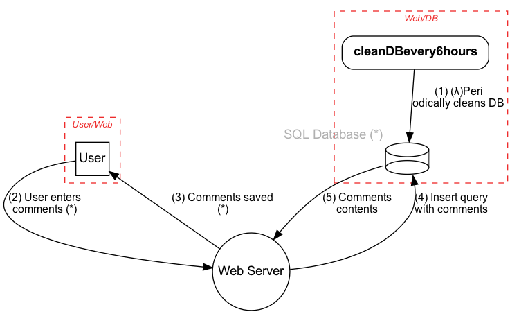

# pytm: A Pythonic framework for threat modeling

Define your system in Python using the elements and properties described in the pytm framework. Based on your definition, pytm can generate, a Data Flow Diagram (DFD), a Sequence Diagram and most important of all, threats to your system.

## Requirements

* Linux/MacOS
* Python 3.x
* Graphviz package
* Java (OpenJDK 10 or 11)
* [plantuml.jar](http://sourceforge.net/projects/plantuml/files/plantuml.jar/download)

## Usage

```text
tm.py [-h] [--debug] [--dfd] [--report REPORT] [--exclude EXCLUDE] [--seq] [--list] [--describe DESCRIBE]

optional arguments:
  -h, --help           show this help message and exit
  --debug              print debug messages
  --dfd                output DFD (default)
  --report REPORT      output report using the named template file (sample template file is under docs/template.md)
  --exclude EXCLUDE    specify threat IDs to be ignored
  --seq                output sequential diagram
  --list               list all available threats
  --describe DESCRIBE  describe the properties available for a given element

```

Currently available elements are: TM, Element, Server, ExternalEntity, Datastore, Actor, Process, SetOfProcesses, Dataflow, Boundary and Lambda.

The available properties of an element can be listed by using `--describe` followed by the name of an element:

```text

(pytm) ➜  pytm git:(master) ✗ ./tm.py --describe Element
Element
	OS
	check
	definesConnectionTimeout
	description
	dfd
	handlesResources
	implementsAuthenticationScheme
	implementsNonce
	inBoundary
	inScope
	isAdmin
	isHardened
	name
	onAWS

```

For the security practitioner, you may add new threats to the `threatlib/threats.json` file:

```json
{
   "SID":"INP01",
   "target": ["Lambda","Process"],
   "description": "Buffer Overflow via Environment Variables",
   "details": "This attack pattern involves causing a buffer overflow through manipulation of environment variables. Once the attacker finds that they can modify an environment variable, they may try to overflow associated buffers. This attack leverages implicit trust often placed in environment variables.",
   "Likelihood Of Attack": "High",
   "severity": "High",
   "condition": "target.usesEnvironmentVariables is True and target.sanitizesInput is False and target.checksInputBounds is False",
   "prerequisites": "The application uses environment variables.An environment variable exposed to the user is vulnerable to a buffer overflow.The vulnerable environment variable uses untrusted data.Tainted data used in the environment variables is not properly validated. For instance boundary checking is not done before copying the input data to a buffer.",
   "mitigations": "Do not expose environment variable to the user.Do not use untrusted data in your environment variables. Use a language or compiler that performs automatic bounds checking. There are tools such as Sharefuzz [R.10.3] which is an environment variable fuzzer for Unix that support loading a shared library. You can use Sharefuzz to determine if you are exposing an environment variable vulnerable to buffer overflow.",
   "example": "Attack Example: Buffer Overflow in $HOME A buffer overflow in sccw allows local users to gain root access via the $HOME environmental variable. Attack Example: Buffer Overflow in TERM A buffer overflow in the rlogin program involves its consumption of the TERM environmental variable.",
   "references": "https://capec.mitre.org/data/definitions/10.html, CVE-1999-0906, CVE-1999-0046, http://cwe.mitre.org/data/definitions/120.html, http://cwe.mitre.org/data/definitions/119.html, http://cwe.mitre.org/data/definitions/680.html"
 }
```

**CAVEAT**

The `threats.json` file contains strings that run through eval\(\) -&gt; make sure the file has correct permissions or risk having an attacker change the strings and cause you to run code on their behalf. The logic lives in the "condition", where members of "target" can be logically evaluated. Returning a true means the rule generates a finding, otherwise, it is not a finding.**

The following is a sample `tm.py` file that describes a simple application where a User logs into the application and posts comments on the app. The app server stores those comments into the database. There is an AWS Lambda that periodically cleans the Database.

```python

#!/usr/bin/env python3

from pytm.pytm import TM, Server, Datastore, Dataflow, Boundary, Actor, Lambda

tm = TM("my test tm")
tm.description = "another test tm"

User_Web = Boundary("User/Web")
Web_DB = Boundary("Web/DB")

user = Actor("User")
user.inBoundary = User_Web

web = Server("Web Server")
web.OS = "CloudOS"
web.isHardened = True

db = Datastore("SQL Database (*)")
db.OS = "CentOS"
db.isHardened = False
db.inBoundary = Web_DB
db.isSql = True
db.inScope = False

my_lambda = Lambda("cleanDBevery6hours")
my_lambda.hasAccessControl = True
my_lambda.inBoundary = Web_DB

my_lambda_to_db = Dataflow(my_lambda, db, "(&lambda;)Periodically cleans DB")
my_lambda_to_db.protocol = "SQL"
my_lambda_to_db.dstPort = 3306

user_to_web = Dataflow(user, web, "User enters comments (*)")
user_to_web.protocol = "HTTP"
user_to_web.dstPort = 80
user_to_web.data = 'Comments in HTML or Markdown'
user_to_web.order = 1

web_to_user = Dataflow(web, user, "Comments saved (*)")
web_to_user.protocol = "HTTP"
web_to_user.data = 'Ack of saving or error message, in JSON'
web_to_user.order = 2

web_to_db = Dataflow(web, db, "Insert query with comments")
web_to_db.protocol = "MySQL"
web_to_db.dstPort = 3306
web_to_db.data = 'MySQL insert statement, all literals'
web_to_db.order = 3

db_to_web = Dataflow(db, web, "Comments contents")
db_to_web.protocol = "MySQL"
db_to_web.data = 'Results of insert op'
db_to_web.order = 4

tm.process()

```

Diagrams are output as [Dot](https://graphviz.gitlab.io/) and [PlantUML](https://plantuml.com/).

When `--dfd` argument is passed to the above `tm.py` file it generates output to stdout, which is fed to Graphviz's dot to generate the Data Flow Diagram:

```bash

tm.py --dfd | dot -Tpng -o sample.png

```

Generates this diagram:




The following command generates a Sequence diagram.

```bash

tm.py --seq | java -Djava.awt.headless=true -jar plantuml.jar -tpng -pipe > seq.png

```

Generates this diagram:


The diagrams and findings can be included in the template to create a final report:

```bash

tm.py --report docs/template.md | pandoc -f markdown -t html > report.html

```
The templating format used in the report template is very simple:

```text

# Threat Model Sample
***

## System Description

{tm.description}

## Dataflow Diagram


## Dataflows

Name|From|To |Data|Protocol|Port
----|----|---|----|--------|----
{dataflows:repeat:{{item.name}}|{{item.source.name}}|{{item.sink.name}}|{{item.data}}|{{item.protocol}}|{{item.dstPort}}
}

## Findings

{findings:repeat:* {{item.description}} on element "{{item.target}}"
}

```

## Currently supported threats

```text
INP01 - Buffer Overflow via Environment Variables
INP02 - Overflow Buffers
INP03 - Server Side Include (SSI) Injection
CR01 - Session Sidejacking
INP04 - HTTP Request Splitting
CR02 - Cross Site Tracing
INP05 - Command Line Execution through SQL Injection
INP06 - SQL Injection through SOAP Parameter Tampering
SC01 - JSON Hijacking (aka JavaScript Hijacking)
LB01 - API Manipulation
AA01 - Authentication Abuse/ByPass
DS01 - Excavation
DE01 - Interception
DE02 - Double Encoding
API01 - Exploit Test APIs
AC01 - Privilege Abuse
INP07 - Buffer Manipulation
AC02 - Shared Data Manipulation
DO01 - Flooding
HA01 - Path Traversal
AC03 - Subverting Environment Variable Values
DO02 - Excessive Allocation
DS02 - Try All Common Switches
INP08 - Format String Injection
INP09 - LDAP Injection
INP10 - Parameter Injection
INP11 - Relative Path Traversal
INP12 - Client-side Injection-induced Buffer Overflow
AC04 - XML Schema Poisoning
DO03 - XML Ping of the Death
AC05 - Content Spoofing
INP13 - Command Delimiters
INP14 - Input Data Manipulation
DE03 - Sniffing Attacks
CR03 - Dictionary-based Password Attack
API02 - Exploit Script-Based APIs
HA02 - White Box Reverse Engineering
DS03 - Footprinting
AC06 - Using Malicious Files
HA03 - Web Application Fingerprinting
SC02 - XSS Targeting Non-Script Elements
AC07 - Exploiting Incorrectly Configured Access Control Security Levels
INP15 - IMAP/SMTP Command Injection
HA04 - Reverse Engineering
SC03 - Embedding Scripts within Scripts
INP16 - PHP Remote File Inclusion
AA02 - Principal Spoof
CR04 - Session Credential Falsification through Forging
DO04 - XML Entity Expansion
DS04 - XSS Targeting Error Pages
SC04 - XSS Using Alternate Syntax
CR05 - Encryption Brute Forcing
AC08 - Manipulate Registry Information
DS05 - Lifting Sensitive Data Embedded in Cache


```
